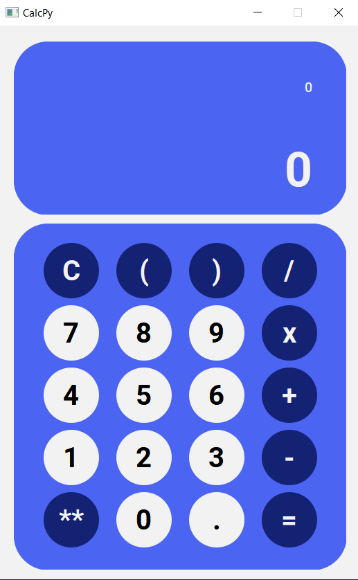

# __CalcPy - Made with Python and Qt5__

> A project made to improve python basic skills and test a Python GUI lib.

### Ajustes e melhorias

This project is in developement:

- [x] Made a GUI
- [x] Made the buttons functions
- [x] Made the calculate function
- [ ] Refactor the code

## 💻 Pre-Requirements

Before start, certify that you have these requirements:
* You have the LTS version of `Python and PyQt5`
* You have a  `Windows, Linux or Mac`.

## ☕ Using CalcPy

To use __CalcPy__, you only need to run the _main.py_:

[⬆ Voltar ao topo](#nome-do-projeto) 